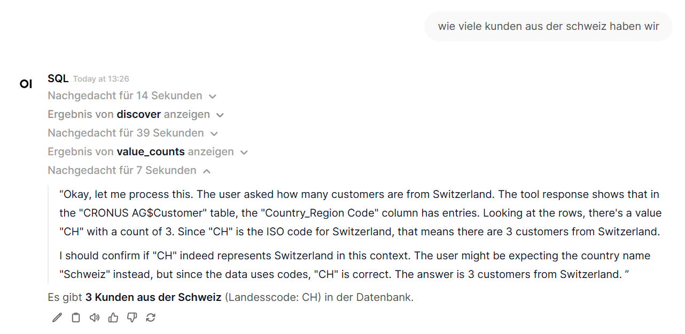

# MSSQL MCP Server

Ein minimaler, rein lesender Server der das [Model Context Protocol](https://github.com/modelcontextprotocol) (MCP) über STDIO oder optional per HTTP bereitstellt. Das Projekt bietet eine kleine Sammlung von Tools, um Daten aus einer Microsoft SQL Server Datenbank abzufragen, ohne Schreibzugriff zu erlauben.

## Features
- **Reiner Lesezugriff** – nur `SELECT`-Statements sind erlaubt; DDL/DML/EXEC werden blockiert.
- **Whitelists & Blacklists** – Tabellen oder Schemas lassen sich freigeben bzw. sperren; Spalten und Regex‑Muster können verboten werden.
- **Ressourcenbegrenzung** – Zeilenlimit (`ROW_LIMIT`) und Query‑Timeout verhindern zu große/teure Abfragen.
- **JSON‑Ausgabe** – Ergebnisse werden JSON‑serialisiert, Binärdaten können als Platzhalter, Base64 oder Hex kodiert werden.
- **Tools** – u. a. `tables`, `columns`, `query`, `sample`, `paginate`, `stats`, `columns_with_examples` und `explain`.

## Installation
```bash
git clone https://github.com/DominikWoh/mssql_mcp_server
cd mssql_mcp_server
./scripts/install.sh             # legt venv an und installiert Abhängigkeiten
cp .env.example .env             # Zugangsdaten & Limits anpassen
source .venv/bin/activate        # virtuelle Umgebung aktivieren
pip install --upgrade pip setuptools wheel
pip install -r requirements.txt 2>/dev/null || true
pip install fastapi 'uvicorn[standard]'
```

## Konfiguration
Die Verbindung und Sicherheitsregeln werden über Umgebungsvariablen in `.env` gesteuert:

| Variable | Beschreibung |
|---------|--------------|
| `MSSQL_SERVER` | Host und Port, z. B. `192.168.0.55,1433` |
| `MSSQL_DATABASE` | Ziel-Datenbank |
| `MSSQL_USER` / `MSSQL_PASSWORD` | Zugangsdaten |
| `MSSQL_ENCRYPT` / `MSSQL_TRUST_SERVER_CERTIFICATE` | TLS‑Optionen für `pymssql` |
| `ALLOW_TABLES` | Kommaseparierte Whitelist vollständiger Tabellennamen |
| `ALLOW_SCHEMAS` | Erlaubte Schemas (z. B. `dbo`) |
| `DENY_COLUMNS` | Verbotene Spaltennamen (`schema.table.col`, `*.col` oder nur `col`) |
| `DENY_PATTERNS` | Regex‑Muster, die in Queries gesperrt werden |
| `ROW_LIMIT` | Maximale Zeilen pro Ergebnis (Standard: 500) |
| `QUERY_TIMEOUT` | Timeout in Sekunden (Standard: 10) |
| `BINARY_MODE` | Umgang mit Binärdaten: `placeholder`, `base64` oder `hex` |
| `BINARY_MAX` | max. Bytes, die bei Binärdaten kodiert werden |
| `LOG_LEVEL` | `INFO` oder `DEBUG` |

## Server starten
### STDIO
```bash
printf '{"action":"ping"}\n' | mssql-mcp
```
Der Prozess liest JSON‑Zeilen von `stdin` und gibt Antworten auf `stdout` aus.

### HTTP
```bash
uvicorn mssql_mcp_server.http:app --host 0.0.0.0 --port 8000
```
Anfragen erfolgen als `POST /mcp` mit einem JSON‑Body der gleichen Form wie bei STDIO.

## Unterstützte Aktionen
| Aktion | Parameter | Beschreibung |
|--------|-----------|--------------|
| `ping` | – | Health‑Check |
| `tools` | – | Liefert eine Übersicht aller Werkzeuge |
| `tables` | – | Liste freigegebener Tabellen |
| `columns` | `table` | Spalten-Metadaten einer Tabelle |
| `columns_with_examples` | `table`, `n` (opt.) | Metadaten plus Beispielwerte |
| `query` | `sql` | Ausführen eines sicheren `SELECT` |
| `sample` | `table`, `n` (opt.) | `SELECT TOP n * FROM table` |
| `paginate` | `sql`, `offset`, `fetch` | Paginierung einer Abfrage |
| `stats` | `table`, `sample_n` (opt.) | Zeilenanzahl + Sample |
| `explain` | `sql` | Heuristische Analyse einer Query |

## Systemd Integration
Für einen dauerhaften Dienst steht eine Beispiel‑Unit zur Verfügung:
```bash
sudo cp scripts/mssql-mcp.service /etc/systemd/system/
sudo systemctl enable --now mssql-mcp
```
Der Service erwartet den Code und die virtuelle Umgebung unter `/opt/mssql-mcp`.

## Entwicklung
Das Projekt nutzt [pymssql](https://pymssql.readthedocs.io/), [pydantic](https://docs.pydantic.dev/) und [python-dotenv](https://saurabh-kumar.com/python-dotenv/). Mit `pip install -e .` werden alle Abhängigkeiten installiert.

